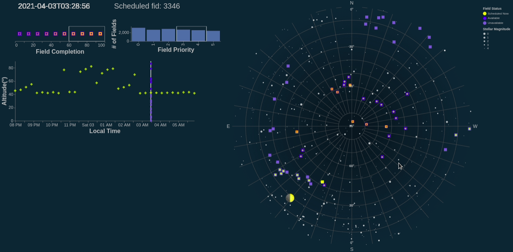
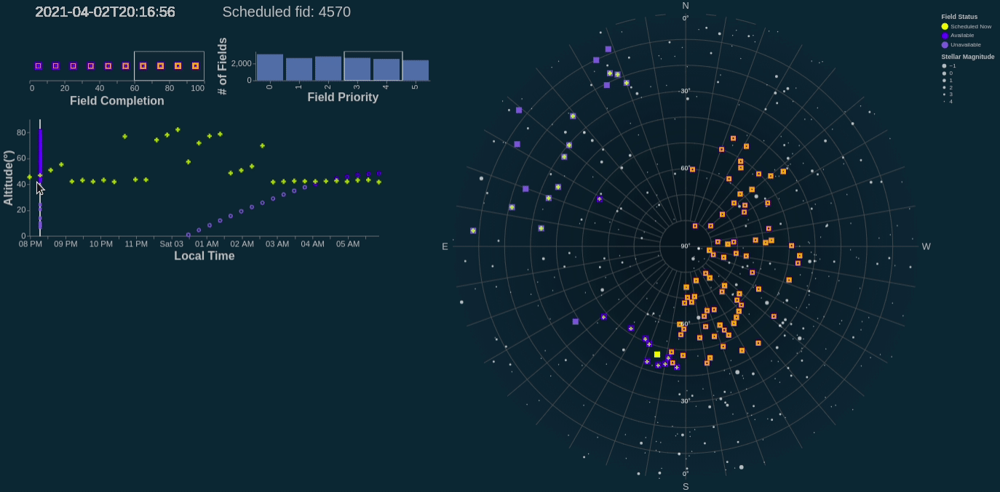
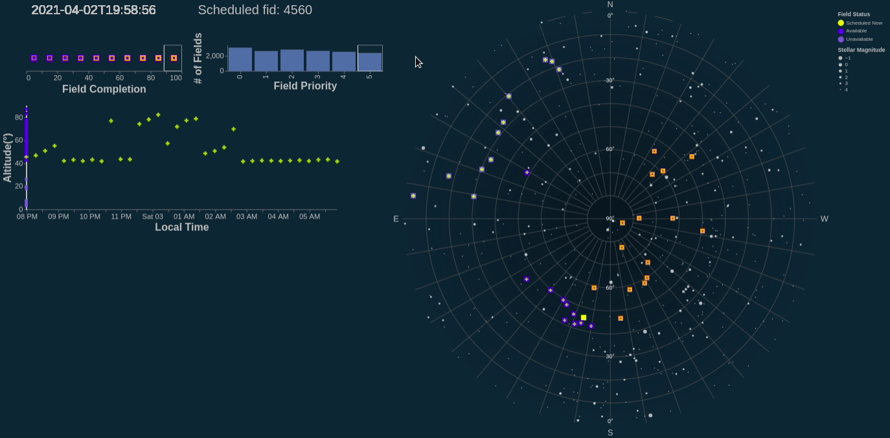
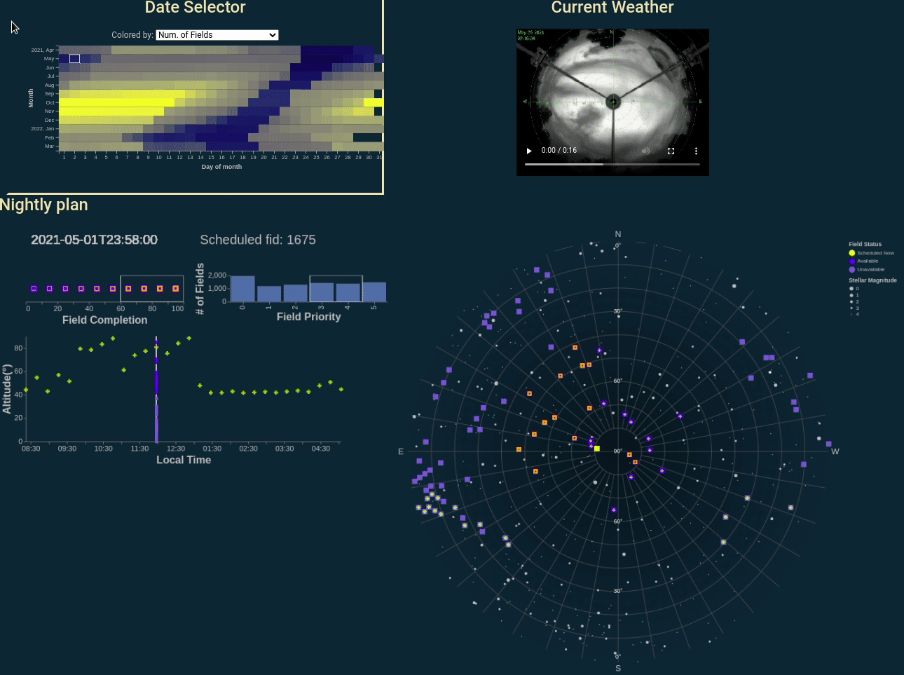
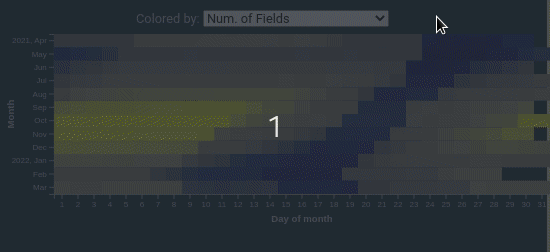
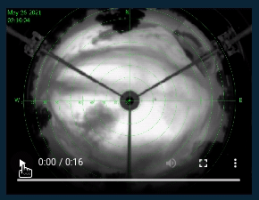
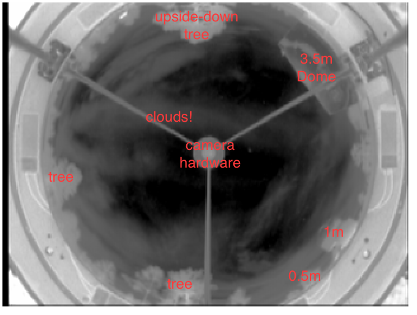

CSE 512 UW Homeworks
=======

# FP-astro-plan
Team members:  
* Conor Sayres  
* Dino Bektesevic  
* Jessica Birky  
* David Wang

Project page: https://www.apo.nmsu.edu/CS/cse512/ 

Project video: https://www.youtube.com/watch?v=4mhJHX6-ywI&t=1s

# SDSS-V:  visualizing a telescopes' nightly plan

## 1. Visualization Motivation
The Sloan Digital Sky Survey (SDSS), is a robotic telescope that scans the sky every night.  It seeks to map large areas of the sky over years-long baselines.  SDSS has broken up the sky into small patches called "fields".  Each field contains a collection of many faint targets (stars or galaxies) that are simultaneously measured in a single image. The night is discretized into 18 minute exposure chunks, one exposure per field.  The night plan is the sequence of fields the telescope visits throughout the night.  The goal of this project is to prototype a helpful visualization of an SDSS night plan to aid the observers collecting data on a nightly basis.

The "optimal" plan for each night is determined algorithmically each day.  When night operations are running smoothly, there is little reason to deviate from the plan.  However, operations do not always run smoothly: weather or technical problems can interrupt observations, and often the telescope operators need to mitigate the situation and change the plan on the fly.  We hope this tool provides a way for operators to quickly come up with alternate observing plans as conditions change throughout the night.  A good visualization will aid quick accurate decision making, especially when the potential space of field options is large.  The important factors for observing a field are "altitude" (how high in the sky the field is: higher altitude leads to better data due to less atmospheric distortion), and how far from the moon the field is (data quality suffers as fields near the moon due to its brightness!), field completion (how many times a field has already been observed in the past), and field priority (scientific value of a field).

This project greatly expands on our A3 prototype (https://cse512-21s.github.io/A3-astroviz/) by including 365 nights worth of data, additional interactive filters, and animated sky footage of weather conditions at the observing site.

## 2. Features

### 2.1 Sky Plot

> ### Field Interaction (right plot)
> 
> We can only choose to point the telescope at a small fraction of the sky at a time. On the sky plot you’ll find a number of dark or light blue squares representing observing “fields”, or regions containing an object (star, galaxy, quasar) that we want to collect data on. The dark blue squares   represent the fields which are “available” to observe at a given time in the night, while the light blue squares represent “unavailable” fields. The yellow square represents the field being observed at that time. The availability of different fields changes over time based on the altitude: if a field is less than 40 degrees above the horizon, Earth’s atmosphere becomes too thick for the telescope to expose through.
>
> To give an intuitive frame of reference, a few hundred stars are plotted in grey where size encodes the star’s brightness. All of these stars are bright enough to be seen by the human eye, so you may be able to recognize some constellation patterns among these background stars. The moon is shown as an emoji according to its phase that night.

  
Design rationale

We took advantage of altair’s projection functions to map our data onto the sky. By mapping azimuth to longitude and altitude to latitude, and projecting using a north pole centered azimuthal equidistant projection, we could produce a circular map of the sky equivalent to a 180 degree fisheye view. Coincidentally, this is the view the all-sky camera at the SDSS telescope sees the sky--for the final project, we may incorporate a feed of this camera and plot fields on top of the live view. We made the background very dark and plotted lighter elements on top. We found this both approximates the sky better, appears less cluttered, and is more visually appealing.
 
Fields planned for observation during the night are plotted as squares corresponding to the area on the sky that would be imaged by the telescope. The yellow field corresponds to the field currently being observed, and the luminous blue (the “opposite” of yellow in L*ab) corresponds to fields not currently being observed, but meeting criteria for observation. We distinguish fields not meeting criteria for observation at that time by coloring them in pale blue. As time progresses, the status of the fields will change, with the colors updating correspondingly. We use tooltips to display the ID of each field and its separation from the moon, which are the two features observers will likely want to reference.

Hovering over a field brings up more information a field highlights the edge in the sky plot in red, and makes the corresponding track in the altitude plot completely opaque, making these points immediately stand out. Points selected in the altitude plot will outline the sky plot as both are linked. The field currently being observed is always in the top layer: this makes them easier to click.

The sizes of background stars correspond to their brightnesses. Astronomers measure this in magnitudes, with 0 being the brightest magnitude and brightness decreasing thereafter. We only plot stars down to 4.5 magnitude: any more and the plot becomes slow and cluttered. This also simulates what the sky looks like in a suburban setting, which may be more familiar to most viewers. The moon is also plotted as a dark grey circle corresponding to the rough size of the moon. A label pops up on mouseover to inform the viewer that this object is the moon since its identity might not be immediately obvious.

The sky plot updates to reflect the time selected in the time vs altitude plot - we found this offered more control, and was both more intuitive and informative, than using a slider.

 

### 2.2 Altitude vs Time Plot

> ### Time Interaction (bottom left plot)
> 
> Mousing over the plot selects the closest time (x-axis) to the cursor. This updates the linked sky plot, which displays the sky at the time selected. Running the cursor horizontally through the bottom thus animates the sky plot to show the motion of the sky over the night. Text in the bottom left of the plot always displays the time selected and the ID of the field observed at that time which the user will often need to reference. Consistent with the sky plot, the yellow square represents the field being observed at that time.

  
Design rationale

Since we wish to optimize the altitude of each field during observation, we also plot the altitude of each field over time in a scatterplot below the sky plot. The initial renderings of these points are transparent, since we will usually only want to compare a few at a time. Selecting a field will cause the points corresponding to this field to become opaque. 

The colors match the field statuses in the sky plot: yellow for currently observing, bright blue for not observing but available, and pale blue for unavailable. Points representing fields currently being observed (one for each time), are also larger and filled in to facilitate easier interaction.

 

### 2.3 Field Completion and Priority

> ### Completeness/Priority Selections (top left plots)
>
> Available fields can also be filtered by completion (encoded with orange overlays on the fields) and priority, allowing astronomers to see alternatives to the scheduled fields.

### 2.4 Calendar

> ### Select Different Dates
>
> The user can explore 365 nights worth of simulated observing strategies using the calendar display in the upper left corner. Hovering over each date displays the value for the variable selected in the drop down menu above the calendar. The user can also change the date by clicking on the calendar, which will change the data displayed in the sky plot/altitude plot below to a different night.

  
Design rationale

The addition of the date selection for a full year's worth of data was one of the major improvements from our A3 prototype (which only included one night's worth of data). The grid-like layout for the date selection is meant to sort of be like a calendar, where the y-axis displays 12 months (April 2021 to March 2022), and the x-axis displays the day of the month (1-31).

<!-- Some description of what we did to cut down data file sizes? -->

 

> ### Select Color Encoding
>
> The drop-down menu above the calendar allows the user to visualize different parameters that influence observing for each night, including: number of fields, moon phase, hours of observing, hours of the night moon is visible, and % of night moon is not visible.

  
Design rationale

Observing conditions change depending on the season of the year (which dictates how many hours of day/night there are), as well as the time of month (which affects the moon phase and what time the moon is up). Observing opportunity becomes more constrained during the summer months when there are less hours of night time, and during periods when the moon is visible and most bright (which can potentially drown out faint sources).

Additionally, we may want to know the number of fields visible in a given night. The more fields that are available to observe, the easier it is to utilize all of the observing time for collecting data, should the weather conditions block out parts of the sky. 

The choice of a yellow-blue map for the color encoding was intended to match the yellow-blue theme used in the sky and altitude plots, and display high contrast. Instead of adding a colorbar to decipher the values associated with the colors (which becomes cluttered, and difficult to pick out individual values), we instead display them using a hover tool, where the value becomes visible when the mouse hovers over.

 

### 2.5 Cloud Cam Demo

> ### Video 
>
> Sometimes, observing plans have to change on the fly due to varying weather conditions during the night. Cloud camera helps us direct the telescope to a part of the sky not covered by the clouds. As a demonstration of what this looks like, we've included an animation of the sky cam from a recent night (May 26, 2021), which can be played in the upper right of the page. 

  
Design rationale

The orientation of the cloud cam feed is exactly the same as the sky plot. For the azimuthal labels (angular axis), the northern axis is at the top and western axis to the left. For the altitude labels (radial axis), 90 degrees at the center would be looking straight up at the sky, and 0 degrees at the edges would be looking towards the horizon.

The upper left hand corner of the aninmation labels the date and time of the frame. We also scaled the colormaps of the images in each frame to emphasize the contrast between clear and cloudy regions of sky.

On the horizon of the cam you can also see the domes of three other instruments at the site (the 0.5m, 1.0m, and 3.5m telescopes), as well as some trees:

In a finalized version of this tool, if it were to be used by astronomers, we would replace this panel with the current live-feed image from the telescope site so that users could compare the sky plot to the weather conditions in real time. However, the live feed images are only served during night time at the observing site. So for the purposes of this data visualization assignment, we instead included an animation of a recent cloudy night, so people can get a sense of what challenging weather conditions astronomers might have to deal with. 

 
